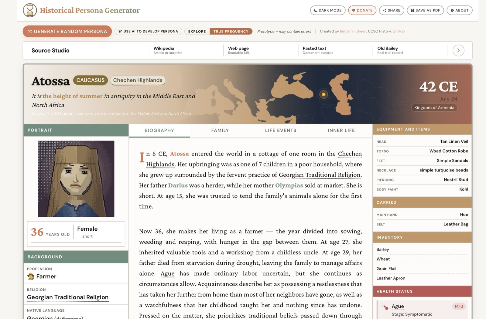
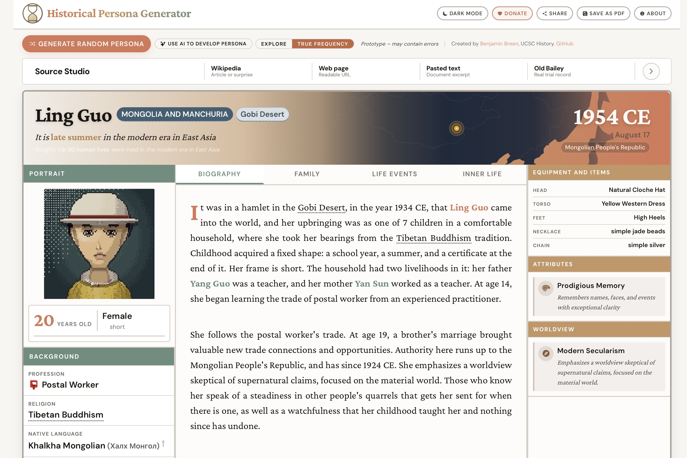
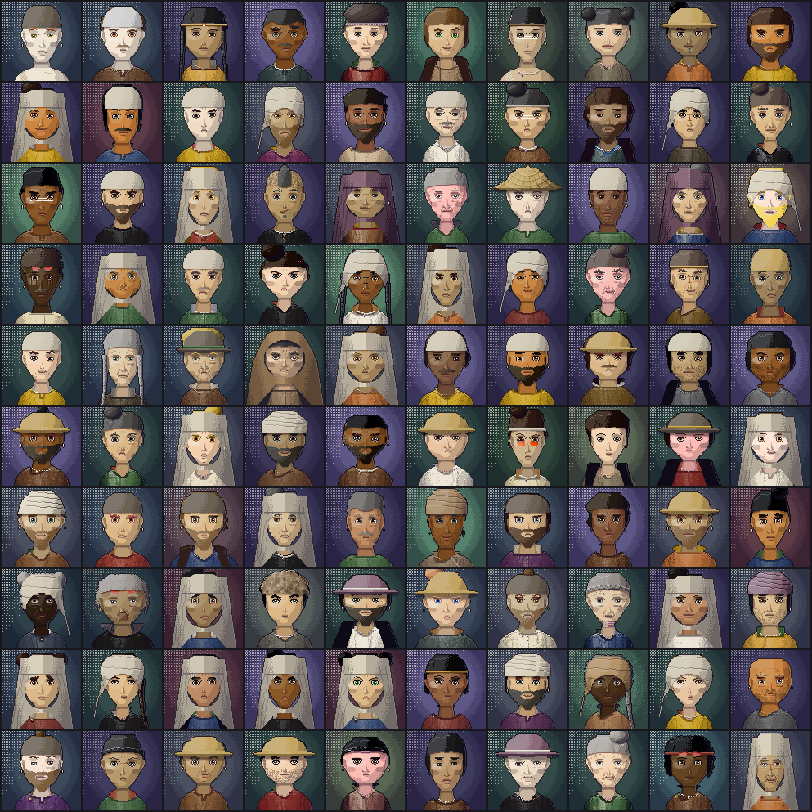
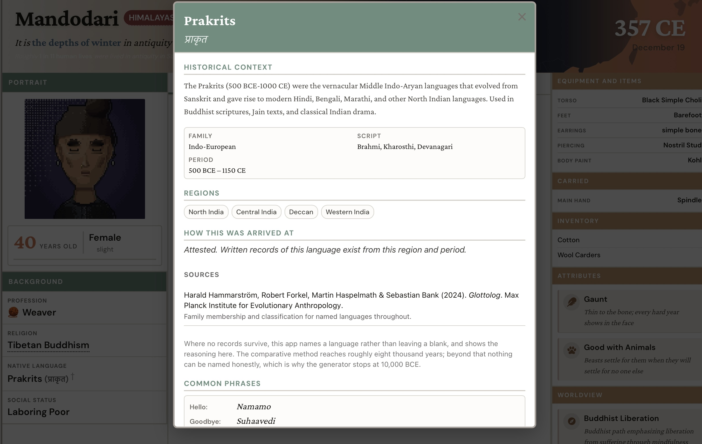
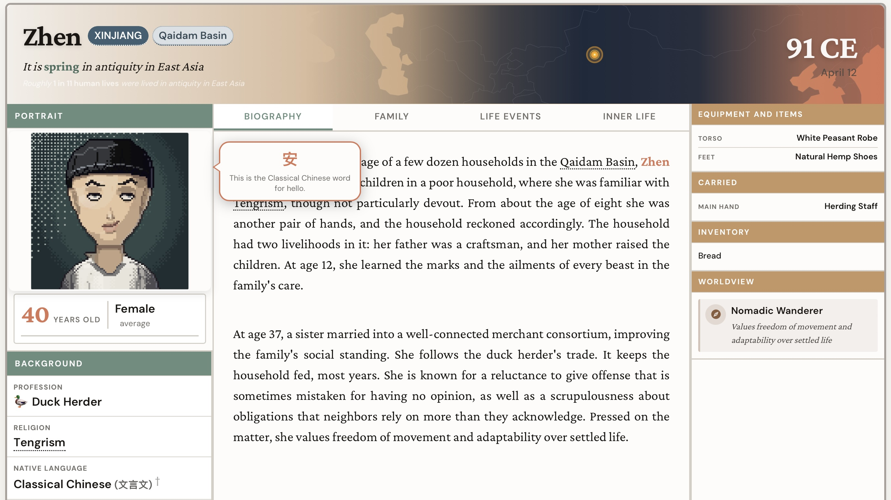
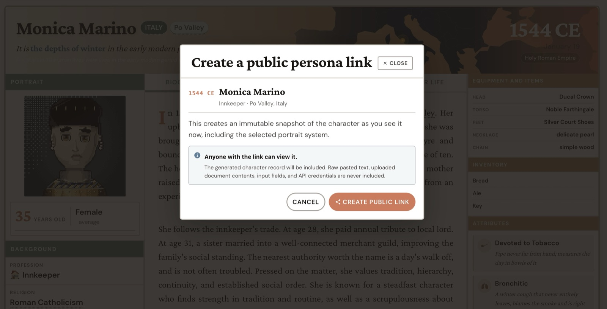

# Historical Persona Generator

**Live: https://historical-persona-generator.vercel.app**



A generator that produces a plausible ordinary person from a given time and place: name, age, household, trade, possessions, beliefs, health, language, and the state they were living under, with a procedurally drawn portrait. I teach world history at UC Santa Cruz and built it as a fast, accessible way for students to explore the range of lives a period actually contained rather than the handful that show up in a textbook. The classroom exercise it was designed for is simple — each student generates a persona, then reconstructs a day in that life while fact-checking the text and other information displayed. Most of the work happens in the fact-checking.

This project began as a procedural historical character generator for the (overly ambitious, now defunct) [Universal History Simulator](https://github.com/benjaminbreen/UHS). As I kept working on it, AI coding tools made things feasible that I wouldn't have attempted alone — the portrait engine, most obviously — and it turned into a longer experiment: how far can a purely procedural system be pushed while staying roughly accurate? It does produce errors. The aim is an educated guess from available evidence, with the reasoning inspectable.

## Who it's for

I built it for my own classroom, but most of the people using it are not historians: writers and game designers who need a character grounded in a period rather than in generic period flavor, tabletop players building someone to run, teachers assembling a lesson, students, and readers who want to see how differently a life could have gone.

One caveat applies to all of them. A generated persona is a historically informed draft, not a reconstruction of a real person — unless a source clearly supports a detail, in which case the app says so.

## What gets generated

Each persona is assembled from constraints rather than sampled from a list of archetypes:

- **Place and polity** — a birthplace, and which state actually held it that year, from ~400 dated polity spans. A life that begins under Roman Britain and ends under something else says so.
- **Social position and work** — status, trade, and household economy filtered by what existed in that region and century.
- **Material life** — possessions, crops, clothing, and tools from regional material availability, not a generic medieval-Europe default.
- **Body and health** — age, disease exposure, and prevalence weighted by period demography.
- **Language** — 137 languages across 73 deep-time windows. Where the record can't supply one the app makes a weighted guess and shows its reasoning and sources.
- **Belief and worldview** — from ~100 belief profiles, with religious practice and personal concerns.
- **Biography** — a short life history written procedurally from all of the above, with dated life events.

Coverage runs 40,000 BCE through the present across nine cultural zones, tightest between roughly 1500 and 1930.

### A note on where personas come from

Asking for "a random historical persona" raises a question the app has to answer somehow: random out of what? The easy answer is to give each of the nine cultural zones an equal chance. But that makes an Oceanian life as likely as an East Asian one, when Oceania was roughly 0.5% of everyone who ever lived and East Asia roughly 26% — equal odds over-represent Oceania about twentyfold. So the app weights each era and region by the number of people actually born there.

Era weights come from the Population Reference Bureau's birth table (Haub 1995, updated Kaneda 2022), integrated rather than guessed: roughly **117 billion humans ever born**. Regional weights are person-year estimates triangulated from McEvedy & Jones. The results are counterintuitive. Antiquity (3000 BCE–500 CE) holds about 40% of all human lives — a long window, populations already in the hundreds of millions, birth rates at their historical maximum. The early modern period (1450–1750), which *feels* central because that is where the archives are, is under 8%. Oceania is about one human life in two hundred.

Sampling by those weights, the likeliest draws are:

| Era and region | Share of all human lives |
| --- | --- |
| Antiquity (3000 BCE–500 CE), South Asia | ~9% |
| Antiquity, East Asia | ~9% |
| Antiquity, Middle East and North Africa | ~7% |
| Medieval (500–1450), South Asia | ~6% |
| Medieval, East Asia | ~6% |
| Antiquity, Europe | ~6% |

There are two sampling modes, and the toggle sits next to the generate button:

- **True Frequency** is an attempt to reproduce those real proportions as closely as the estimates allow. Pick a random human life and this is roughly what you get: most often a farmer in ancient or medieval South or East Asia.
- **Explore** raises the same weights to a fractional power. The ordering survives — antiquity still comes up more often than the industrial era — but the extremes pull in far enough that the whole world is reachable in one sitting, including the Oceanic, Sahelian, and pre-Columbian material that true weighting would surface roughly once in two hundred spins.

In both modes the card prints the real odds of the combination it drew — *roughly 1 in 20 human lives* — so the flattening is never silent. The full methodology, including what was measured and corrected, is in [docs/DEMOGRAPHY.md](docs/DEMOGRAPHY.md).



## Portraits



Seeded SVG. No stock art and no image model: the same seed always renders the same face, and every portrait above is a separate draw from the same code.

The renderer works like a print process rather than a paper doll. Colour ramps and a pixel buffer sit at the bottom (`core/`), with masks, lighting, and a small stamp format for reusable pixel shapes. Above that, one file per feature (`art/`) — `face`, `eyes`, `brows`, `noses`, `mouths`, `ears`, `hair`, `headwear`, `garments`, `garmentSurface`, `garmentFeatures`, `ornaments`, `details`, `background`, `palette` — each drawing its own layer into the buffer, so a hat brim and a nose bridge can be worked on independently. `spec/anatomy.ts` holds the proportions everything hangs off.

The bridge is `spec/buildSpec.ts`, the only file that knows about the app's character model. It resolves a portrait spec by precedence: evidence-derived visual overrides from the source document beat what the persona is actually wearing, which beats the procedural fallback. Colour names resolve through `constants/gameData/colorNames.ts` so that "woad" and "madder" reach the renderer as pigments rather than strings, and health, fatigue, age, and wealth feed weathering, scarring, dentition, and expression.

`npm run portrait-audit` runs the real persona generator, renders every result headlessly, and reports which garments, coverings, ages, and markings actually occurred, plus any portrait that came out structurally broken. The first run flagged 97 problems in 200 personas — 80 faces whose eyes were down to two visible pixels, 25 whose entire garment was buried under a veil — none of which were reachable from the hand-picked fixture set.

## Language



Every persona gets a native language. Click it and the modal gives the family, script, period, regions, and a few common phrases, along with **how this was arrived at**: attested from written records for that region and period, or inferred, with the scholarship cited — Glottolog and 58 other sources. Where nothing can be named honestly it says so. The comparative method reaches back about eight thousand years, which is why the generator stops at 10,000 BCE.

Terms in the biography carry the same treatment. Hover one and you get the word in the persona's own language, with a gloss.



## Source Studio

The bar above the persona card takes a **Wikipedia article** (or a surprise one), any **readable web page**, **pasted text** from a document, or a real **Old Bailey trial record**. The app reads it for period, place, and social world, then generates someone plausible from that source's world — not the author or the named subject, but a person who could have been in the room.

Fields are labeled by provenance: supported by the source, inferred from context, plausibly synthesized, or too uncertain to state. An optional model call fills the annotation schema when heuristic parsing is not enough; without an API key the app falls back to heuristics and still works.

## Everything else

- **Save as PDF** — a two-page print sheet: portrait, profile, and equipment on the first page, the dated life chronicle on the second. This is the handout version for section.
- **Share** — creates an immutable public snapshot at a short URL, so a specific persona survives instead of being re-rolled from a seed. Raw pasted text, uploaded documents, and credentials are never included.

  

- **JSON schema record** — the full persona machine-readable with confidence and support labels intact (annotation schema `1.1.0`). This is what I use for experiments with historical LLM personas and related AI research, where a life flattened into prose loses the part you need.
- **Use AI to Develop Persona** — an optional model pass that writes a longer biography from a persona the generator has already built.
- **Tabs** — Biography, Family, Life Events, and Inner Life, each generated from the same constraint set.
- **Wikipedia links** — place names, religions, and languages in the biography link out, so fact-checking is one click rather than a search.
- **Dark mode**, and an **About** panel describing the method.

## Running it

```bash
npm install
npm run dev
```

Serves at `http://localhost:3001`. No API key required. Model setup, rate limits, deployment, and share-link storage are in [docs/SETUP.md](docs/SETUP.md).

## Accuracy

A generator like this fails quietly. Anachronism creeps in, every life gets written in the same three sentence shapes, a Javanese farmer ends up dressed like a Yorkshire one — and none of it throws an error. So there is a set of checks that run against real generator output:

```bash
npm run verify
```

- **Golden personas** pin a fixed matrix of seeds and compare the whole rendered persona against a committed file, line by line. Nobody has to predict the fault in advance; they only have to notice that a line changed. Every defect found by hand in the first week — a Japanese sedge hat on a Formosan farmer, a Swedish Muslim in 1920, "a sprained ankle in his ankle" — had passed every property-based assertion in the suite and was caught by a person reading one card. This is the net for that.
- **Cultural fit** asks whether names come from the right tradition for the place (a colonial-pool name in a colonised region is the failure to count), and whether the assigned language is an actual language rather than a family label like "Niger-Congo language of the region" — an honest answer for 8000 BCE and a bad one for 1997.
- **Anachronism risk** looks for lookup tables keyed by a bucket too coarse to be true across its own span, which is how `samurai clan` was once offered to a Formosan Austronesian and `killed in World War I` to a death in 1897.
- **Narrative variety** measures how repetitive the generated prose is across a large corpus of biographies. It strips names and numbers out of every sentence to get its skeleton, then checks two things: that no single skeleton accounts for more than 3% of all sentences, and that fewer than 40% of them are era-agnostic — appearing in nearly every period, which means they are filler rather than history. That second figure was 46% when first measured; gating childhood, trade, temperament, and outlook by era brought it to 35%.
- **Portrait audit** renders a large sample and reports structural breakage and the actual distribution of garments, coverings, and markings.

Most of these are thresholds rather than pass/fail assertions. Each is committed just above what currently holds, so when a number improves the threshold is tightened to follow it and the old, worse level stops being acceptable. The point is that quality cannot quietly slide back to where it was. [docs/FAILURE_MODES.md](docs/FAILURE_MODES.md) is the running list of ways the generator has been wrong.

**React 19 · TypeScript · Vite · AJV · SVG**

## Credits

By [Benjamin Breen](https://benjaminpbreen.com), Associate Professor of History at UC Santa Cruz. Originally extracted from the Universal History Simulator. Free to use.

## License

MIT
